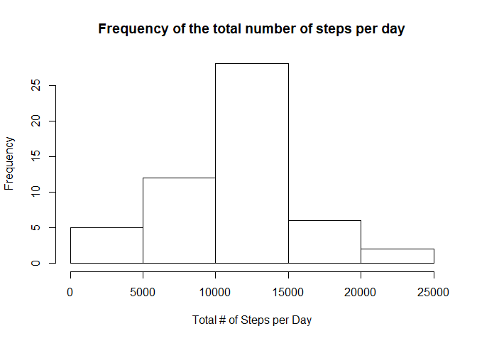
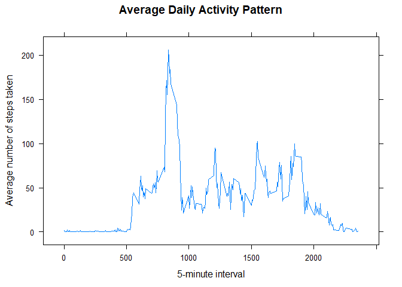
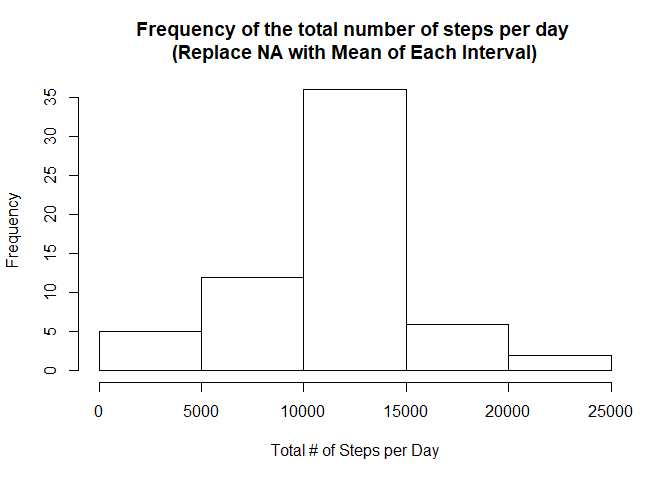
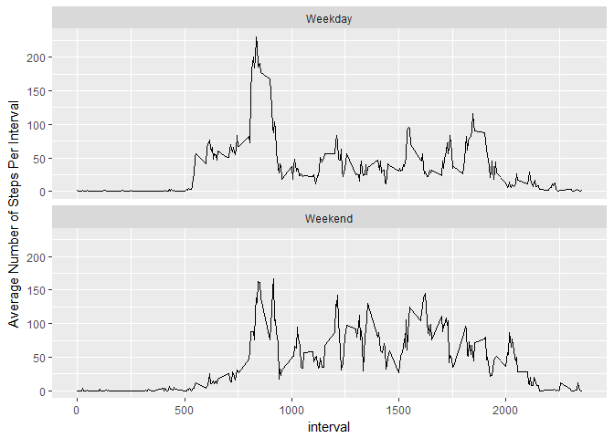

## Loading and preprocessing the data


```r
library(dplyr)
```

```
## 
## Attaching package: 'dplyr'
```

```
## The following objects are masked from 'package:stats':
## 
##     filter, lag
```

```
## The following objects are masked from 'package:base':
## 
##     intersect, setdiff, setequal, union
```

```r
library(ggplot2)
```

```
## Warning: package 'ggplot2' was built under R version 3.4.4
```

```r
library(lattice)
```

```
## Warning: package 'lattice' was built under R version 3.4.4
```

```r
activity <- read.csv(unzip("C:\\Users\\aklk1998\\RepData_PeerAssessment1\\activity.zip","activity.csv")) ## loading data
str(activity)
```

```
## 'data.frame':	17568 obs. of  3 variables:
##  $ steps   : int  NA NA NA NA NA NA NA NA NA NA ...
##  $ date    : Factor w/ 61 levels "2012-10-01","2012-10-02",..: 1 1 1 1 1 1 1 1 1 1 ...
##  $ interval: int  0 5 10 15 20 25 30 35 40 45 ...
```

## Histogram of the total number of steps taken each day


```r
activity1<-select(transform(activity[complete.cases(activity),],date1=as.Date(as.character(date),"%Y-%m-%d")),steps,date1)  ## remove all NA observations and convert date from factor variable to date variable for future usage.
str(activity1)
```

```
## 'data.frame':	15264 obs. of  2 variables:
##  $ steps: int  0 0 0 0 0 0 0 0 0 0 ...
##  $ date1: Date, format: "2012-10-02" "2012-10-02" ...
```

```r
total_by_date<-group_by(activity1,date1)  ## group the steps by date1
total_by_date1<-summarize(total_by_date,total_steps=sum(steps)) ## Summarize the total # of steps per day

hist(total_by_date1$total_steps,xlab="Total # of Steps per Day", main="Frequency of the total number of steps per day")
```

<!-- -->

## What is mean total number of steps taken per day?


```r
mean1 <- mean(total_by_date1$total_steps)
mean1
```

```
## [1] 10766.19
```

```r
median1 <- median(total_by_date1$total_steps)
median1
```

```
## [1] 10765
```

The mean total number of steps taken per day is 1.0766189\times 10^{4}
The median total number of steps taken per day is 10765.

## What is the average daily activity pattern?


```r
activity2<-select(activity[complete.cases(activity),],steps,interval)  ## remove all NA observations and select only steps and interval for further processing.
str(activity2)
```

```
## 'data.frame':	15264 obs. of  2 variables:
##  $ steps   : int  0 0 0 0 0 0 0 0 0 0 ...
##  $ interval: int  0 5 10 15 20 25 30 35 40 45 ...
```

```r
average_by_interval<-group_by(activity2,interval) ## group the steps by interval
average_by_interval1<-summarize(average_by_interval,mean_steps=mean(steps)) ## calculate the average steps per interval across all days

with(average_by_interval1,xyplot(mean_steps~interval,type = "l",xlab="5-minute interval",ylab="Average number of steps taken",main="Average Daily Activity Pattern")) ## plot a time series of the 5-minute interval (x axis) against the average number of steps (y axis)
```

<!-- -->

```r
temp<-average_by_interval1[average_by_interval1$mean_steps==max(average_by_interval1$mean_steps),] ## Identify which 5-minute interval, on average across all the days in the dataset, contains the maximum number of steps 
temp
```

```
## # A tibble: 1 x 2
##   interval mean_steps
##      <int>      <dbl>
## 1      835       206.
```

Interval 835 has the maximum number of average steps 206.1698113

## Imputing missing values


```r
total_missing<-sum(is.na(activity)) ## calculate the number of NAs
total_missing 
```

```
## [1] 2304
```

Total Number of NAs is : 2304

Create a new matrix activity3 by replacing NA with the average number of steps per interval across all days


```r
activity3<-activity
activity3$steps[is.na(activity3$steps)]<-average_by_interval1$mean_steps[match(activity3$interval,average_by_interval1$interval)][which(is.na(activity3$steps))] ## replace NA in steps by the average number of steps per interval across all days by matching interval value in activity3 to average_by_interval1
```

Replot the histogram


```r
activity4<-select(transform(activity3,date1=as.Date(as.character(date),"%Y-%m-%d")),steps,date1)  ## convert date from factor variable to date variable
str(activity4)
```

```
## 'data.frame':	17568 obs. of  2 variables:
##  $ steps: num  1.717 0.3396 0.1321 0.1509 0.0755 ...
##  $ date1: Date, format: "2012-10-01" "2012-10-01" ...
```

```r
total_by_date_imputted1 <-group_by(activity4,date1)  ## group the steps by date1
total_by_date_imputted2<-summarize(total_by_date_imputted1,total_steps=sum(steps)) ## Summarize the total # of steps per day

hist(total_by_date_imputted2$total_steps,xlab="Total # of Steps per Day", main="Frequency of the total number of steps per day \n(Replace NA with Mean of Each Interval)")
```

<!-- -->


```r
mean2 <- mean(total_by_date_imputted2$total_steps)
mean2
```

```
## [1] 10766.19
```

```r
median2 <- median(total_by_date_imputted2$total_steps)
median2
```

```
## [1] 10766.19
```

For the imputted matrix:

The new mean total number of steps taken per day is 1.0766189\times 10^{4}
The new median total number of steps taken per day is 1.0766189\times 10^{4}

Because NA is replaced by the average number of steps per interval across all days, mathematically there are 8 missing days (Oct 1, Oct 8, Nov 1, Nov 4, Nov 9, Nov 10, Nov 14 and Nov 30) and each missing day is assigned the mean of the average number of steps per day 1.0766189\times 10^{4}.  Henceforth imputting the missing data does not really change the distribution or the result. A better imputting strategy is required.


## Are there differences in activity patterns between weekdays and weekends?

Plot a time series of the 5-minute interval (x-axis) and the average number of steps taken, averaged across all weekday days or weekend days (y-axis).


```r
activity5<-select(transform(activity3,date1=as.Date(as.character(date),"%Y-%m-%d")),steps,date1,interval)  ## convert date from factor variable to date variable
activity6<-transform(activity5,WeekInd=ifelse(weekdays(activity4$date) %in% c("Sunday","Saturday"),"Weekend","Weekday"))  ## Assign either Weekend or Weekday to each date

total_by_int_week1<-group_by(activity6,interval,WeekInd) ## group the steps by interval and weekend/weekday
total_by_int_week2<-summarize(total_by_int_week1,mean_steps=mean(steps)) ## Calcualte the average # of steps by interval and Weekend/Weekday

ggplot(data=total_by_int_week2, aes(x=interval, y=mean_steps)) + geom_line() + facet_wrap(~WeekInd,nrow=2) + labs(y="Average Number of Steps Per Interval")   
```

<!-- -->
